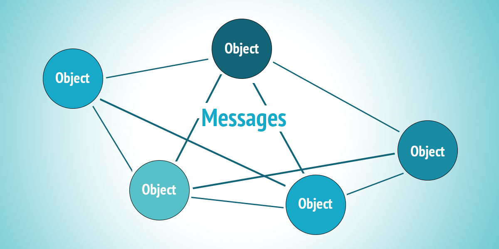

# Обектно-ориентирано програмиране

?

# Обектно-ориентирано програмиране (C++, ООП, 1 курс)

* Изброими типове (enums)
* Четене и писане в текстови и двоични файлове
* Класове, обекти, методи, конструктори, селектори (getter-и) и мутатори (setter-и)
* Rule of 3 - копиращ конструктор, оператор =, деструктор
* Статични полета и методи
* Изключения (exceptions)
* Предефиниране на оператори
* Наследяване и композиция
* Абстрактни класове
* Полиморфизъм
* Множествено наследяване
* Шаблони за дизайн - Singleton, Factory, Builder
* Шаблони (Templates)

# "Кои са 4-те принципа на ООП-то?" (C++, ООП, 1 курс)

::: incremental

* Енкапсулация
* Абстракция
* Наследяване
    * (Преизползване)
* Полиморфизъм

:::

# Кой е това?

{ height=512 }

# Кой е това?

{ height=384 }
{ height=384 }

::: { .fragment }

Alan Kay<span class="fragment"><br/>предлага термина ООП (c. 1967)</span>

::: 

# ООП?

> “I made up the term ‘object-oriented’, and I can tell you I didn’t have C++ in mind.” -- Alan Kay

# [Dr. Alan Kay on the Meaning of<br />“Object-Oriented Programming”](http://userpage.fu-berlin.de/~ram/pub/pub_jf47ht81Ht/doc_kay_oop_en)

> “I thought of objects being like biological cells and/or individual computers on a network, only able to communicate with messages… <span class="fragment">OOP to me means only messaging, local retention and protection and hiding of state-process, and extreme late-binding of all things.” -- Alan Kay</span>

::: { .fragment }

Забележете, че не се споменават класове, наследяване и др.

:::

# В основата на ООП -- съобщенията

<p style="margin: 0">
{ height=200 style="border-radius: 10px; margin: 0" }
</p>

::: incremental

* Множество познати ни ООП принципи (като SOLID) се фокусират върху практики за дизайн на **един** клас
* ООП всъщност е:
  - система от обекти,
  - комуникиращи помежду си
* Добър ООП дизайн обхваща цялостната комуникация и участващите обекти
* В познатите езикови ни конструкции съобщения са методите
* Алън Кей прави паралел с биологичните организми
  * система от самостоятелни клетки и органи,
  * комуникиращи си чрез хормони, нервни сигнали, messengerRNA и др.

:::

# Енкапсулация

::: incremental

* Не е просто getter-и и setter-и
* Контрол над това как външният свят може да достъпва или модифицира данните
* Обектите не са структури от данни
* Енкапсулацията при обектите се отнася до това, че скриват своето състояние и структурите, които използват, от другите обекти
* Обектите си взаимодействат единствено през ясен протокол (интерфейс/възможни съобщения) - поведение на обекта

:::

# Late Binding

::: incremental

* Конкретното поведение, което ще се изпълни, се разбира едва по време на изпълнение
* Подтиповия полиморфизъм е един аспект на late binding
* В по-голям мащаб: подмяна на части от системата без да се спира цялата система

:::

# [ООП + ФП?](https://www.quora.com/Why-is-functional-programming-seen-as-the-opposite-of-OOP-rather-than-an-addition-to-it/answer/Alan-Kay-11)

::: incremental

* ООП не предполага странични ефекти
* Може да се използва по immutable и функционален подход

:::

::: { .fragment }

> "So: both OOP and functional computation can be completely compatible (and should be!). There is no reason to munge state in objects, and there is no reason to invent “monads” in FP. We just have to realize that “computers are simulators” and figure out what to simulate." -- Alan Kay

:::

::: { .fragment }

ООП във функционален език:

* Структура и модулярност 
* Контекст (в който са валидни функциите)
* Подтипов полиморфизъм и late binding

:::

# Дефиниране на клас

* Параметри на клас -- конструктор
* Членове
* Модификатори на достъп

::: { .fragment }

Да дефинираме клас `Rational`

:::

# Дефиниране на обект

::: { .fragment }

```scala
object Math:
  val Pi = 3.14159

  def gcd(a: Int, b: Int): Int = if b == 0 then a else gcd(b, a % b)
  
  def squared(n: Int) = n * n

Math.Pi
Math.gcd(27, 12)
```

:::

::: { .fragment }

```scala
val m: Math.type = Math
m.squared(9)
```

:::

# `apply` методи

Всеки обект с `apply` метод може да бъде използван като функция:

::: { .fragment }

```scala
object AddTwo:
  def apply(n: Int): Int = n + 2

val theLongAnswer = AddTwo.apply(40) // 42
val theAnswer = AddTwo(40) // 42
```

:::

# `apply` методи

```scala
class Interval(a: Int, b: Int, inclusive: Boolean = true):
  require(a <= b)
  
  def apply(n: Int) =
    if (inclusive) a <= n && n <= b
    else a < n && n < b

val percentageInterval = new Interval(0, 100)
percentageInterval(42) // true
percentageInterval(110) // false
```

# Обекти-другарчета (придружаващи/companion обекти)

::: incremental

* В Scala класовете нямат статични методи
* Вместо това помощни функции могат да бъдат дефинирани в техните придружаващи обекти 🤝
* Обект придружава клас, ако
  - е дефиниран със същото име като класа и
  - се намира в същия файл

:::

# Обекти-другарчета (придружаващи/companion обекти)

```scala
class Rational:
  // ...

object Rational:
  val Zero = Rational(0) // използва apply, дефиниран долу
  
  def apply(n: Int, d: Int = 1) = new Rational(n, d)
  
  def sum(rationals: Rational*): Rational =
    if rationals.isEmpty then Zero
    else rationals.head + sum(rationals.tail)

Rational.sum(Rational(1, 2), Rational(5), Rational(3, 5)) // не е нужно да пишем new
```

# Придружаващи обекти

`List(1, 2, 3)` се свежда до `List.apply(1, 2, 3)`,<br />което е функция с променлив брой параметри

# Придружаващи обекти

Имат достъп и до private/protected членовете:

```scala
class Rational private (n: Int, d: Int):
  private def toDouble = n.toDouble / d
  
  // ...


object Rational:
  def apply(n: Int, d: Int = 1) = new Rational(n, d)
  
  def isSmaller(a: Rational, b: Rational) = a.toDouble < b.toDouble


Rational.isSmaller(Rational(1, 2), Rational(3, 4)) // true
```

# implicit конверсия

```scala
Rational(2, 3) + 1 // грешка при компилиране, + приема Rational, не Int
```

::: { .fragment }

```scala
implicit def intToRational(n: Int): Rational = Rational(n)

Rational(2, 3) + 1 // Rational(5, 3), работи
```

:::

# implicit конверсия

```scala
implicit def intToRational(n: Int): Rational = Rational(n)

Rational(2, 3) + 1 // Rational(5, 3)
1 + Rational(2, 3)  // Rational(5, 3), също работи
```

::: { .fragment }

Преобразува се до:

```scala
Rational(2, 3) + intToRational(1) // Rational(5, 3)
intToRational(1) + Rational(2, 3)  // Rational(5, 3), също работи
```

:::

::: { .fragment }

Когато компилаторът не открие метод с очакваните име и параметри<br />решава да потърси за възможна имплицитна конверсия към тип,<br />който има този метод

:::

# implicit конверсия -- ред на търсене

1. В текущия scope (чрез текущ или външен блок или чрез import)
2. В продружаващия обект на който и да е от участващите типове

# Още за implicit конверсии

::: incremental

* Добре е да се ограничават
* Изискват `import scala.language.implicitConversions`
* Препоръчително е използването на конверсии с по-конкретни типове пред по-общи

:::

# X-Ray от IntelliJ 2023.3

* Показва цялата липсваща типова информация с един shortcut – типове на променливи, функции, междинни изрази и други
* През него IntelliJ ни показва също използваните implicit конверсии 
* Shortcut: натиснете Ctrl (или Cmd на Mac) два пъти и задръжте
* През него може да се навигира към използваната функция за конверсия
* От 2024.1 – могат да се включват за постоянно чрез `Ctrl/Cmd + Alt + Shift + X`

# case класове

```scala
case class Person(name: String, age: Int, address: String)

val vasil = Person("Vasil", 38, "Sofia")
```

::: incremental

* неизменим value клас
* всички изброени параметри автоматично стават `val` полета
* автоматично генериране на:
  - придружаващ обект с `apply`
  - `equals`, `hashCode`, `toString`
    ```scala
      Person("Vasil", 38, "Sofia") == Person("Vasil", 38, "Sofia") // true
    ```
  - `copy` -- позволява инстанциране на нова версия, базирана на съществуващата
    ```scala
       def getOlder(person: Person): Person = person.copy(age = person.age + 1)
    ```
  - още няколко удобства -- за тях по-натам

:::

# Влагане на case класове

```scala
case class Person(name: String, age: Int, address: Address)
case class Address(country: String, city: String, street: String)

val radost = Person("Radost", 24, Address("Bulgaria", "Veliko Tarnovo", "ul. Roza"))
```

# Поведение на case класове

```scala
case class Circle(radius: Double):
  def area = math.Pi * radius * radius

```

```scala
case class Person(name: String, age: Int, address: Address):
  def sayHiTo(person: Person): String =
    s"Hi ${person.name}! I am $name from ${address.country}"
```

# Универсален apply { .scala3 }

В Scala 3 автоматично се генерира придружаващ обект с apply за всеки клас (не само за case класовете):

::: { .fragment }

```scala
class Rational(n: Int, d: Int)

Rational(1, 2) // работи
new Rational(1, 2) // също работи
```

:::

# Абстрактни типове -- trait

```scala
trait Ordered[A]:
  def compare(that: A): Int
  
  def <(that: A): Boolean = compare(that) < 0
  def <=(that: A): Boolean = compare(that) <= 0
  def >(that: A): Boolean = compare(that) > 0
  def >=(that: A): Boolean = compare(that) >= 0
```

# Абстрактни типове -- trait

```scala
class Rational(n: Int, d: Int) extends Ordered[Rational]):
  // ...

  def compare(that: Rational): Int = (this - that).numer

Rational(3, 4) < Rational(1, 2) // false
```

# Uniform Access Principal

```scala
trait Humanoid:
  def name: String
  def age: Int
```

::: { .fragment }

```scala
class Person(n: String, a: Int) extends Humanoid:
  val name = n
  val age = a

class Robot(brand: String, serialNumber: String, a: Int) extends Humanoid:
  def name = s"$brand--$serialNumber"
  val age = a
```

:::

::: { .fragment }

```scala
val personName = new Person("Alex", 21).name
val robotName = new Robot("mi6-42", "000007", 1).name
```

:::

::: { .fragment }

UAC -- интерфейсът не се променя от това дали дадено име е имплементирано чрез ичисление (`def`)<br />или чрез съхранена стойност (`val`)

:::

# Uniform Access Principal и case класове

```scala
trait Humanoid:
  def name: String
  def age: Int

case class Person(name: String, age: Int) extends Humanoid
case class Robot(brand: String, serialNumber: String, age: Int) extends Humanoid:
  def name = s"$brand--$serialNumber"
```

# import клаузи

::: { .fragment }

```scala
import scala.util.Try // само типа Try

Try(10)
```

:::

::: { .fragment }

```scala
import scala.util.* // всичко от util пакета
// import scala.util._ Scala2 синтаксис. Все още работи в Scala3

Try(10)
Success(10)
```

:::

::: { .fragment }

```scala
import math.Math.{ gcd, Pi } // няколко неща от обекта Math

gcd(42, 18) * Pi
```

:::

# import клаузи

::: { .fragment }

```scala
import math.Math.* // всичко от oбекта Math

squared(11)
gcd(42, 10)
```

:::

::: { .fragment }

```scala
import scala.collection.immutable.Set
import scala.collection.mutable.{ Set as MutableSet } // преименуване
// import scala.collection.mutable.{ Set => MutableSet } // Scala2

Set(1, 2, 3)
MutableSet(4, 5, 6)
```

:::

::: { .fragment }

```conf
rewrite.scala3.convertToNewSyntax = true
```

:::

::: { .fragment }

```scala
import scala.collection.immutable.Set
import scala.collection.mutable // импорт на част от пътя

Set(1, 2, 3)
mutable.Set(4, 5, 6)
```

:::

# import клаузи

::: incremental

* Могат да са във всеки scope, не е нужно да са в началото на файла:
  
  ```scala
  class Rational(n: Int, d: Int):
    import Math.gcd
    
    gcd(n.abs, d.abs)
    // ...
  ```
* Автоматично във всеки файл се включват следните import-и:
  ```scala
  import java.lang.*
  import scala.*
  import scala.Predef.*
  ```

:::

# export клаузи { .scala3 }

Позволяват делегация:

```scala
object IntUtils:
  def twice(n: Int): Int = 2 * n
  def squared(n: Int): Int = n * n

object DoubleUtils:
  def twice(n: Double): Double = 2 * n
  def squared(n: Double): Double = n * n

object MathUtils:
  export IntUtils.*
  export DoubleUtils.*

MathUtils.twice(2) // 4
MathUtils.twice(2.0) // 4.0
```

::: incremental 

* export-натите имена стават членове на обекта
* синтактично е със същия формат като `import`

:::

# export клаузи { .scala3 }

```scala
class Scanner:
  def scan(image: Image): Page = ???
  def isOn: Boolean = ???

class Printer:
  def print(page: Page): Image = ???
  def isOn: Boolean = ???

class Copier:
  private val scanner = new Scanner
  private val printer = new Printer
  
  export scanner.scan
  export printer.print
  
  def isOn = scanner.isOn && printer.isOn

val copier = new Copier
val image = ???
val copiedImage = copier.print(copier.scan(image))

image == copiedImage // true, hopefully :D
```

# Изброени типове { .scala3 }

```scala
enum WeekDay:
  case Monday, Tuesday, Wednesday, Thursday, Friday, Saturday, Sunday
```

::: { .fragment }

```scala
def isWorkingDay(day: WeekDay) = day != WeekDay.Saturday && day != WeekDay.Sunday
isWorkingDay(WeekDay.Wednesday) // true, :(
```

:::

::: { .fragment }

```scala
WeekDay.valueOf("Monday") // WeekDay.Monday

WeekDay.values // Array(Monday, Tuesday, Wednesday, Thursday, Friday, Saturday, Sunday)
```

:::

# Extension Methods

::: incremental

* Добавяне на методи към съществуващи типове
* Само в текущия scope

:::

# Extension Methods { .scala3 }

```scala
extension (n: Int)
  def squared = n * n
  def **(exp: Double) = math.pow(n, exp)

3.squared // 9
2 ** 3 // 8.0
```

# Extension Methods { .scala3 }

Могат да бъдат overload-вани,<br />import-ват се по името на метода:

```scala
// file NumberExtensions.scala
package scalafmi.numberextensions

extension (n: Int)
  def squared = n * n
  def **(exp: Double) = math.pow(n, exp)

extension (n: Double)
  def squared = n * n
  def **(exp: Double) = math.pow(n, exp)
```

```scala
// file Demo.scala
import scalafmi.numberextensions.{ squared, ** }

3.squared // 9
2 ** 3 // 8.0

3.14.squared
2.71 ** 4
```

# Extension Methods { .scala3 }

```scala
extension (xs: List[Double])
  def avg = xs.sum / xs.size

List(1.0, 2.0, 3.0).avg // 2.0
List("a", "b", "c").avg // грешка, value avg is not a member of List[String]
```

::: { .fragment }

```scala
extension [A](xs: List[A])
  def second = xs.tail.head

List(1.0, 2.0, 3.0).second // 2.0
List("a", "b", "c").second // b
```
:::

# Търсене на extension методи –<br />точно като при implicits

1. В текущия scope (чрез текущ или външен блок или чрез import)
2. В продружаващия обект на който и да е от участващите типове

# Extension методи в придружаващ обект

```scala
object Rational:
  extension (xs: List[Rational])
    def total: Rational =
      if xs.isEmpty then 0
      else xs.head + xs.tail.total
      
    def avg: Rational = xs.total / xs.size
```

# Extension Methods в Scala 2

::: incremental

* Scala 2 също позволява добавяне на методи
* Използва се механизма за implicit конверсия
* Все още се среща масово в библиотеките за Scala<br />(независимо от версията)

:::

# Extension Methods чрез implicit<br />(стар подход от Scala 2)

```scala
class EnrichedInt(val n: Int) extends AnyVal:
  def squared = n * n
  def **(exp: Double) = math.pow(n, exp)

implicit def intToEnrichedInt(n: Int) = new EnrichedInt(n)

3.squared // 9
2 ** 3 // 8.0
```

# Extension Methods чрез implicit<br />(стар подход от Scala 2)

```scala
implicit class EnrichedInt(val n: Int) extends AnyVal:
  def squared = n * n
  def **(exp: Double) = math.pow(n, exp)

3.squared // 9
2 ** 3 // 8.0
```

::: { .fragment }

Тук не е нужен `import scala.language.implicitConversions`

:::

# Примери от стандартната библиотека

```scala
1 -> "One" // (1, "One"), -> се добавя към всички типове

// extension methods се използва за добавяне на методите за колекции върху String
"abcdef".take(2) // ab

import scala.concurrent.duration.DurationInt
5.seconds // scala.concurrent.duration.FiniteDuration = 5 seconds
```

# Когато типът е твърде общ?

```scala
def createAddressRegistration(personId: String, locationId: String) = ???
```

```scala
val stoyanId = "100"
val ruseId = "5"
createAddressRegistration(ruseId, stoyanId) // компилира се 😬
```

# Type Safety чрез opaque типове { .scala3 }

```scala
opaque type PersonId = String
object PersonId:
  def apply(id: String): PersonId = id
  extension (personId: PersonId) def value: String = personId

opaque type LocationId = String
object LocationId:
  def apply(id: String): LocationId = id
  extension (locationId: LocationId) def value: String = locationId

def createAddressRegistration(person: PersonId, location: LocationId) = ???
```

::: { .fragment }

```scala
val stoyanId = PersonId("100")
val ruseId = LocationId("5")
createAddressRegistration(stoyanId, ruseId) // успех
createAddressRegistration(ruseId, stoyanId) // грешка, не е възможно да ги объркаме
```

:::

::: incremental

* Компилаторът счита `PersonId` и `LocationId` като напълно различни типове
  * с изключение в scope-а, в който са дефинирани – там те са взаимозаменяеми
* Runtime и двете се представят чрез типа `String`
* Това осигурява type safety за ползвателите на opaque типовете
* В Scala 2 подобно поведение се постига чрез [`AnyVal` класове](https://scala-fmi.github.io/scala-fmi-2024/lectures/03-oop-in-a-functional-language.html#/anyval-%D0%BA%D0%BB%D0%B0%D1%81%D0%BE%D0%B2%D0%B5/4)

:::

# Opaque типовете могат да дефинират операции

```scala
opaque type Meter = Double
object Meter:
  def apply(value: Double): Meter = value
  extension (self: Meter)
    def value: Double = self
    def +(that: Meter): Meter = Meter(self + that)
    def *(coefficient: Double): Meter = Meter(coefficient * self)
    def show: String = s"$self meters"
```

::: { .fragment }

```scala
case class Circle(radius: Meter):
  def circumference: Meter = radius * 2 * math.Pi

Circle(Meter(2)).circumference.show // 12.566370614359172 meters
```

:::

# Типизиране -- съвместимост на типове

```scala
val a: A = new B

// кога тип B е съвместим с тип A?
```

::: incremental

* Номинално -- типове се проверяват за съвместимост по тяхното име (и по явна релация с други имена)
  - Аз съм бухал, защото са ми казали, че съм бухал
  - Аз като бухал съм птица, защото всички бухали са птици
  - "B наследява A"
* Структурно -- съвместимост на типове се определя по структурата на обекта (по неговото поведение)
  - Аз съм бухал, защото гукам като бухал и защото мога да летя
  - Аз като бухал съм птица, защото мога да летя
  - "B има същите методи (т.е. същата структура) като A"
  
:::

# Структурно типизиране в Scala

```scala
case class Eagle(name: String):
  def flyThrough(location: String): String =
    s"Hi, I am old $name and I am looking for food at $location."

case class Owl(age: Int):
  def flyThrough(location: String): String =
    s"Hi, I am a $age years old owl and I am flying through $location. Hoot, hoot!"
```

::: { .fragment }

```scala
def checkLocations(
  locations: List[String],
  bird: { def flyThrough(location: String): String }
): List[String] = 
  for
    location <- locations
  yield bird.flyThrough(location)

checkLocations(List("Sofia", "Varna"), Owl(7))
```

:::

# Структурно типизиране в Scala

```scala
case class Eagle(name: String):
  def flyThrough(location: String): String =
    s"Hi, I am old $name and I am looking for food at $location."

case class Owl(age: Int):
  def flyThrough(location: String): String =
    s"Hi, I am a $age years old owl and I am flying through $location. Hoot, hoot!"
```

```scala
type Bird = {
  def flyThrough(location: String): String
}

def checkLocations(locations: List[String], bird: Bird): List[String] =
  for
    location <- locations
  yield bird.flyThrough(location)

checkLocations(List("Sofia", "Varna"), Eagle("Henry"))
```

::: incremental

* Върху JVM се имплементира чрез reflection, поради което изисква:

```scala
import reflect.Selectable.reflectiveSelectable
```
* Ако не искаме да използваме reflection, можем да имплементираме `Selectable` интерфейса

:::

# Типова алгебра { .scala3 }

::: { .fragment }

Scala 3 добавя сечение (`&`) и обединение (`|`) на типове

:::

# Сечение на типове (`&`) { .scala3 }

```scala
trait LovingAnimal:
  def name: String
  def hug = s"A hug from $name"

case class Owl(name: String, age: Int):
  def flyThrough(location: String): String =
    s"Hi, I am a $age years old owl and I am flying through $location. Hoot, hoot!"

val lovelyOwl: Owl & LovingAnimal = new Owl("Oliver", 7) with LovingAnimal
lovelyOwl.hug // A hug from Oliver
lovelyOwl.flyThrough("Plovdiv") // Hi, I am a 7 years old owl and
                                // I am flying through Plovdiv. Hoot, hoot!
```

# Обединение на типове (`|`) { .scala3 }

```scala
def toInteger(value: String | Int | Double): Int = value match
  case n: Int => n
  case s: String => s.toInt
  case d: Double => d.toInt

toInteger("10") // 10
toInteger(10) // 10
toInteger(10.0) // 10
toInteger(List(10)) // не се компилира
```

# Обединение на типове (`|`) { .scala3 }

```scala
def toInteger(value: String | Int | Double): Int = value match
  case n: Int => n
  case s: String => s.toInt
```

::: { .fragment }

```
|def toInteger(value: String | Int | Double): Int = value match
|                                                   ^^^^^
|                                  match may not be exhaustive.
|
|                                  It would fail on pattern case: _: Double
```

:::

::: { .fragment }

Превърнете в грешка чрез<br />`-Xfatal-warnings`:

```scala
scalacOptions += "-Xfatal-warnings"
```

:::

# Обединение на типове (`|`) { .scala3 }

```scala
def registerUser(registrationForm: RegistrationForm): RegistrationFormError | User = ???
```

# The Expression Problem

::: {.fragment}

> The goal is to define a datatype by cases, where one can add new cases to the datatype and new functions over the datatype, without recompiling existing code, and while retaining static type safety (e.g., no casts).

:::

# The Expression Problem (алтернативно)

::: incremental

* Добавяне на нов тип без промяна на съществуващия код
* Добавяне на нова операция без промяна на съществуващия код

:::

# ООП подход

```scala
trait Shape:
  def area: Double

case class Circle(r: Double) extends Shape:
  def area: Double = math.Pi * r * r

case class Rectangle(a: Double, b: Double) extends Shape:
  def area: Double = a * b
```

# ФП подход

```scala
trait Shape
case class Circle(r: Double) extends Shape
case class Rectangle(a: Double, b: Double) extends Shape

def area(s: Shape): Double = s match
  case Circle(r) => math.Pi * r * r
  case Rectangle(a, b) => a * b
```

::: { .fragment }

`case` класовете могат да бъдат използвани в pattern matching

:::

# Добавяне на операция във ФП -- лесно

```scala
def circumference(s: Shape): Double = s match
  case Circle(r) => 2 * math.Pi * r
  case Rectangle(a, b) => 2 * (a + b)
```

# Добавяне на операция в ООП -- трудно, промяна на всички класове

```scala
trait Shape:
  def area: Double
  def circumference: Double

case class Circle(r: Double) extends Shape:
  def area: Double = math.Pi * r * r
  def circumference = 2 * math.Pi * r

case class Rectangle(a: Double, b: Double) extends Shape:
  def area: Double = a * b
  def circumference = 2 * (a + b)
```

# Добавяне на тип в ООП -- лесно

```scala
case class Square(a: Double) extends Shape:
  def area: Double = a * a
  def circumference: Double = 4 * a
```

# Добавяне на тип във ФП -- трудно

```scala
case class Square(a: Double) extends Shape

def area(s: Shape): Double = s match
  case Circle(r) => math.Pi * r * r
  case Rectangle(a, b) => a * b
  case Square(a) => a * a

def circumference(s: Shape): Double = s match
  case Circle(r) => 2 * math.Pi * r
  case Rectangle(a, b) => 2 * (a + b)
  case Square(a) => 4 * a
```

# The Expression Problem

::: incremental

* Всеки език е добре да предоставя изразни средства и за двата проблема
* ООП подходът е подходящ за типове с предварително неизвестен брой случаи и малко основни операции
* Функционалният подход е подходящ за типове с предварително фиксирани случаи

:::

# ООП дизайн?

# ООП дизайн -- скрити домейн обекти

```scala
def buyTea(cc: CreditCard, paymentService: PaymentService): Tea =
  val teaCup = new Tea(...)
  paymentService.charge(cc, teaCup.price)
  teaCup
```

::: { .fragment }

```scala
case class Charge(cc: CreditCard, amount: Double)

def buyTea(cc: CreditCard): (Tea, Charge) =
  val teaCup = new Tea(...)
  (teaCup, Charge(cc, teatCup.price)
```

:::

::: { .fragment }

Отлагане на страничния ефект =>

::: incremental

* скрити домейн концепции изплуват на яве (`Charge` обект)
* моделираме дейности като данни
* които допълнително можем да трансформираме функционално
  - купуване на n кафета и събиране на Charge-ове
  - анализ на Charge-ове от различни потребители
* по-добра тестваемост

:::

:::

# [Таблица на типовите елементи в Scala](https://github.com/scala-fmi/scala-fmi-2024/blob/main/resources/type-elements-in-scala.md)

# Въпроси :)?

