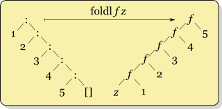
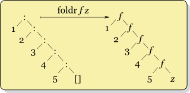
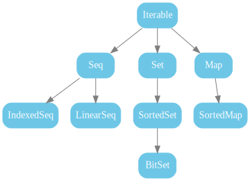
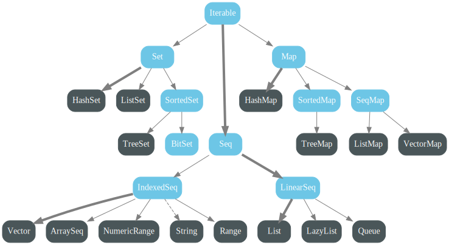
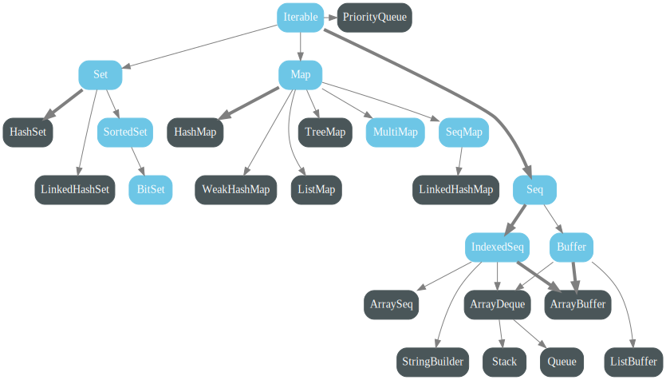

# map?

```scala
@tailrec
def map(l: List[Int], f: Int => Int, acc: List[Int] = Nil): List[Int] =
  if l.isEmpty then acc.reverse
  else map(l.tail, f, l.head :: acc)(f)
```

# параметризиран map

```scala
@tailrec
def map[A,B](l: List[A], f: A => B, acc: List[B] = Nil): List[B] =
  if (l.isEmpty) acc.reverse
  else map(l.tail, f, l.head :: acc)
```

::: { .fragment }

```
-- [E007] Type Mismatch Error: -------------------------------------------------
3 |  else map(l.tail, f, l.head :: acc)
  |                      ^^^^^^
  |                      Found:    A
  |                      Required: B
  |
  | longer explanation available when compiling with `-explain`
1 error found
```

:::

# Fold

```scala
trait Seq[A]:
  def fold(initial: A)(f: (A, A) => A): A
  ...
```

::: { .fragment }

```scala
List(20, -40, 30).fold(0): (a, b) =>
  math.max(a.abs, b.abs)
// 40
```

:::

# foldLeft и foldRight

```scala
trait Seq[A]:
  def foldLeft[B](initial: B)(f: (B, A) => B): B
  def foldRight[B](initial: B)(f: (A, B) => B): B
  ...
```

::: { .fragment }

 

:::

::: { .fragment }

foldLeft: `f(f(f(f(f(z, 1), 2), 3), 4), 5)`

foldRight: `f(z, f(1, f(2, f(3, f(4, 5)))))`

:::

# map и filter чрез foldLeft/foldRight

```scala
def map[A, B](l: List[A])(f: A => B): List[B] = ???

def filter[A](l: List[A])(f: A => Boolean): List[A] = ???
```

# Няколко други функцийки

```scala
def f1[A](l: List[A]): Int = ???
```

```scala
def f2(l: List[Int]): Int = ???
```

```scala
def f3[A](l: List[A]): List[A] = ???
```

```scala
def f4[A](l1: List[A], l2: List[A]): List[A] = ???
```

```scala
def f5[A](l: List[A], x: A): Boolean = ???
```

::: { .fragment }

foldLeft/foldRight внасят абстракция над опашковата рекурсия,<br />
в случай на операции върху колекции (т.е. предварително известни елементи)

:::

# факториел/фибоначи чрез fold???

```scala
def fact(n: Int): Int = ???
def fib(n: Int): Int = ???
```

::: { .fragment }

```scala
def fact(n: Int): Int = (1 to n).foldLeft(1)(_ * _)

def fib(n: Int): Int =
  (1 to n)
    .foldLeft((a = 0, b = 1))((acc, _) => (acc.a, acc.a + acc.b))
    .a

```

:::

# Lazy evaluation при foldLeft/foldRight?

foldLeft: `f(f(f(f(f(z, 1), 2), 3), 4), 5)`<br />
винаги стигаме до последния елемент – не е възможен lazy evaluation

::: { .fragment }

foldRight: `f(z, f(1, f(2, f(3, f(4, 5)))))`<br />
Ако параметрите се подават по име или lazily (Haskell), `f` може да реши да прекъсне изчислението по-рано<br />

:::

::: { .fragment }

В Scala се изчисляват strict-но и stack safe

:::

::: { .fragment }

(В Haskell foldl и foldr трупат стек, foldl' е strict и stack safe)

:::

# Липса на short-circuit – пример

```scala
def forall[A](l: List[A])(f: A => Boolean): Boolean = ???
```

::: { .fragment }

```scala
def forall[A](l: List[A])(f: A => Boolean): Boolean = 
  l.foldLeft(true)((acc, next) => acc && f(next))
```

:::

::: { .fragment }

Ако желаем да прекъснем по-рано,<br /> ни се налага да използваме опашкова рекурсия:

```scala
@tailrec
def forall[A](l: List[A])(f: A => Boolean): Boolean =
  if l.isEmpty then true
  else if !(f(l.head)) then false
  else forall(l.tail)(f)
```

:::

# exists

```scala
def exists[A](l: List[A])(f: A => Boolean): Boolean = ???
```

::: { .fragment }

```scala
def exists[A](l: List[A])(f: A => Boolean): Boolean = !forall(l)(!f(_))
```

:::

# Колекции



::: { .fragment }

Има три версии:
```scala
scala.collection.immutable.* // неизменими структури
scala.collection.mutable.* // изменими структури
scala.collection.generic.* // общи trait-ове и за двете – позволява имплементация на код,
                           // работещ и с двата вида структури
```

:::

# Неизменими колекции



# Неизменими колекции

Всеки trait има `apply`, който създава колекция с default-на имплементация:

```scala
Seq(1, 2, 3) // List(1, 2 3)
Set(1, 2, 3, 4, 5, 6) // HashSet(5, 1, 6, 2, 3, 4)
Set(1, 2, 3) // Set(1, 2, 3) – фиксиран Set на 3 елемента
```

# Изменими колекции



# Колекциите са функции

```scala
val dict = Map(1 -> "one", 2 -> "two")
List(1, 2).map(dict) // List("one", "two")
```

::: { .fragment }

```scala
val dict = Map(1 -> "one", 2 -> "two").withDefaultValue("unknown")
List(1, 2, 3).map(dict) // List("one", "two", "unknown)
```

:::

::: { .fragment }

```scala
val vector = Vector(5, 3, 4)
List(2, 0).map(vector) // List(4, 5)
```

:::

::: { .fragment }

```scala
val set = Set(1, 3, 5, 8)
(1 to 10).map(set) // Vector(true, false, true, false, true,
                   //        false, false, true, false, false)
```

:::

# Uniform Return Type Principle

```scala
Vector(1, 2, 3).map(_ * 2) // Vector(2, 4, 6)

Map(1 -> "one", 2 -> "two", 3 -> "three").map((key, value) => value -> key) 
// Map("one" -> 1, "two" -> 2, "three" -> 3)

Set(1.0, 2.0, 3.0).map(_ / 2) // Set(0.5, 1.0, 1.5)

BitSet(1, 4, 10, 20).map(_ + 1) // BitSet(2, 5, 11, 21)
```

::: { .fragment }


```scala
Map(1 -> "one", 2 -> "two", 3 -> "three").map((_, value) => value) 
// List("one", "two", "three"): Iterable[String]

(1 to 10).map(_ * 2) // Vector(2, 4, 6, 8, 10, 12, 14, 16, 18, 20): IndexedSeq[Int]

BitSet(1, 4, 10, 20).map(_.toString) // TreeSet("1", "10", "20", "4"): SortedSet[String]

```

:::

# Частични функции

```scala
trait PartialFunction[A, B] extends Function1[A, B]:
  def isDefinedAt(a: A): Boolean
  def apply(a: A): B
```

::: { .fragment }

```scala
val reciprocal = new PartialFunction[Int, Double]:
  def isDefinedAt(n: Int) = n != 0
  def apply(n: Int) =
    if isDefinedAt(n) then 1.0 / n
    else throw new MatchError("Division by zero")
    
List(1, 2, 3, 4, 5).map(reciprocal) // List(1.0, 0.5, 0.3333333333333333, 0.25, 0.2)
```

:::

::: { .fragment }

```scala
trait Seq[A]:
  def collect[B](pf: PartialFunction[A, B]): Seq[B]

List(-2, -1, 0, 1, 2).collect(reciprocal) // List(-0.5, -1.0, 1.0, 0.5)
```

:::

# Частични функции

::: { .fragment }

Pattern matching-а може да дефинира частични функции:

```scala
val reciprocal: PartialFunction[Int, Double] = {
  case n if n != 0 => 1.0 / n
}
List(-2, -1, 0, 1, 2).collect(reciprocal) // List(-0.5, -1.0, 1.0, 0.5)

List(-2, -1, 0, 1, 2).collect:
  case n if n != 0 => 1.0 /   n 
// List(-0.5, -1.0, 1.0, 0.5)
```

:::

::: { .fragment }

Map е частична функция:

```scala
val dict = Map(1 -> "one", 2 -> "two")
List(0, 1, 2, 3).collect(dict) // List("one", "two")
```

:::

# Комбиниращи методи

```scala
trait Seq[A]:
  // комбинира filter и filterNot
  def partition(predicate: A => Boolean): (List[A], List[A])

  // комбинира take и drop
  def splitAt(n: Int): (List[A], List[A])

  // комбинира takeWhile и dropWhile
  def span(predicate: A => Boolean): (List[A], List[A])
```

::: { .fragment }

```scala
List(5, 10, 3, -1, 8, 9).partition(_ % 2 == 0) // (List(10, 8), List(5, 3, -1, 9))

List(5, 10, 3, -1, 8, 9).splitAt(2) // (List(5, 10), List(3, -1, 8, 9))

List(5, 10, 3, -1, 8, 9).span(_ > 0) // (List(5, 10, 3), List(-1, 8, 9))
```

:::

# 

```scala
trait Seq[A]:
  def zip[B](other: Seq[B]): Seq[(A, B)]
  def groupBy[K](f: A => K): Map[K, Seq[A]]

  // маха едно ниво на влагане, напр. 
  def flatten[B](/* ... */): B
  // като комбинация от map + flatten
  def flatMap[B](f: A => Seq[B]): Seq[B]
```

::: { .fragment }

```scala
List(1, 2, 3, 4).zip(List("one", "two", "three")) // List((1, "one"), (2, "two"), (3, "three"))

List(
  Person("Zdravko", "Varna"),
  Person("Petar", "Varna"),
  Person("Alex", "Sofia"),
  Person("Nikoleta", "Karnobat"),
  Person("Aleksandar", "Varna"),
  Person("Kamen", "Sofia")
).groupBy(_.city)
// Map(
//   "Varna" -> List(Person("Zdravko", "Varna"), Person("Petar", "Varna"),
//                     Person("Aleksandar", "Varna")),
//   "Sofia" -> List(Person("Alex", "Sofia"), Person("Kamen", "Sofia"))
//   "Karnobat" -> List(Person("Nikoleta", "Karnobat"))
// )


List(List(1, 2), List(3), List(4, 5)).flatten // List(1, 2, 3, 4, 5)
List(1, 10, 100).flatMap(n => List(n, n + 1, n + 2))
// List(1, 2, 3, 10, 11, 12, 100, 101, 102
```

:::

# Намерете разликите на съседните елементи

```scala
val list = List(1, 3, 8, 11, 15, 17, 24, 27, 32)

list.tail.zip(list).map(_ - _)
// List(2, 5, 3, 4, 2, 7, 3, 5)
```

# Всички поднизове на низ

```scala
val s = "abcd"
val prefixes = s.inits.toList // List("abcd", "abc", "ab", "a", "")
val suffixes = s.tails.toList // List("abcd", "bcd", "cd", "d", "")

prefixes.flatMap(_.tails).filterNot(_.isEmpty)
// List("abcd", "bcd", "cd", "d", "abc", "bc", "c", "ab", "b", "a")
```

# for

```scala
val list = List(1, 2, 3)
for
  i <- list
  if i % 2 == 0
  c <- 'a' to 'c'
yield s"$i$c"
// List("2a", "2b", "2c")
```

::: { .fragment }

for е syntax sugar за:

```scala
list
  .withFilter(i => i % 2 == 0)
  .flatMap(i =>
    ('a' to 'c').map(c =>
      s"$i$c"
    )
  )
```

:::

::: { .fragment }

* Като `doSeq` в Haskell
* Помага избягване на вложеност
* `withFilter` е non-strict версия на `filter`

:::

# Как да имплементираме Option тип?

# Вариантност

```scala
val apples: List[Apple] = List(Apple("red", 2), Apple("green", 5), Apple("yellow", 3))

// това е очаквано
val applesSeq = Seq[Apple] = apples

// но ще се компилира ли следния код?
val fruits: List[Fruit] = apples
```

# Non-strict и lazy изчисления

* non-strict: arguments are evaluated on demand
* lazy: evaluation is memoized

# views – non-strict колекции

```scala
def doubleView(s: Seq[Int]) =
  s.view.map: x =>
    println("Calculating " + x)
    x * 2
  
val longRange = 1 to 10000
val view = doubleView(longRange).take(10)
println(view.toList)
println(view.toList)
```


# LazyList

```scala
def doubleLazyList(s: Seq[Int]) =
  s.to(LazyList).map: x => 
    println("Calculating " + x)
    x * 2

val longRange = 1 to 10000
val stream = doubleLazyList(longRange).take(10)
println(stream.toList)
println(stream.toList)
```

# LazyList fibs

```scala
val fibs: LazyList[Int] = 0 #:: 1 #:: fibs.zip(fibs.tail).map(_ + _)

fibs.take(5)
```

# Имплементиране на LazyList

# Option – методи пред pattern matching

```scala
option match
  case None => ()
  case Some(x) => foo(x)
```

::: { .fragment }

[Option API](https://www.scala-lang.org/api/current/scala/Option.html)

:::

::: { .fragment }

Тип: `Unit`

:::

::: { .fragment }

Еквивалент:
```scala
option.foreach(foo)
```

:::

# Option – методи пред pattern matching

```scala
option match
  case None => Nil
  case Some(x) => x :: Nil
```

::: { .fragment }

Тип: `List[?]`

:::

::: { .fragment }

Еквивалент:
```scala
option.toList
```

:::

# Option – методи пред pattern matching

```scala
option match
  case None => false
  case Some(_) => true
```

::: { .fragment }

Тип: `Boolean`

:::

::: { .fragment }

Еквивалент:
```scala
option.isDefined
```

:::

# Option – методи пред pattern matching

```scala
option match
  case None => true
  case Some(x) => foo(x)
```

::: { .fragment }

Тип: `Boolean`

:::

::: { .fragment }

Еквивалент:
```scala
option.forall(foo)
```

:::

# Option – методи пред pattern matching

```scala
option match
  case None => None
  case Some(x) => Some(foo(x))
```

::: { .fragment }

Тип: `Option`

:::

::: { .fragment }

Еквивалент:
```scala
option.map(foo)
```

:::

# Option – методи пред pattern matching

```scala
option match
  case None => None
  case Some(x) => foo(x)
```

::: { .fragment }

Тип: `Option`

:::

::: { .fragment }

Еквивалент:
```scala
option.flatMap(foo)
```

:::

# Option – методи пред pattern matching

```scala
option match
  case None => None
  case Some(x) => x
```

::: { .fragment }

Тип: `Option`

:::

::: { .fragment }

Еквивалент:
```scala
option.flatten
```

:::

# Option – методи пред pattern matching

```scala
option match
  case None => foo
  case Some(x) => Some(x)
```

::: { .fragment }

Тип: `Option`

:::

::: { .fragment }

Еквивалент:
```scala
option.orElse(foo)
```

:::

# Option – методи пред pattern matching

```scala
option match
  case None => foo
  case Some(x) => x
```

::: { .fragment }

Тип: `type of foo | x`

:::

::: { .fragment }

Еквивалент:
```scala
option.getOrElse(foo)
```

:::

# Въпроси :)?
