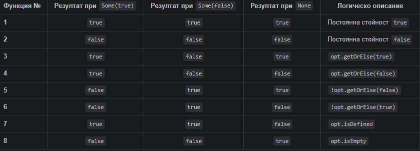

# Какво е Pattern Matching?

::: incremental

* Мощен инструмент, използван основно в функционалните езици за програмиране
* Проверява някаква стойност спрямо някакъв шаблон/образец
* Използва се за декомпозиция на данни от по-сложни структури
* Прилича на `switch/case` изрази, но е много по-гъвкав и мощен

:::

# Синтаксис

```scala
def getDayOfWeek(day: Int): String = day match
  case 1 => "Monday"
  case 2 => "Tuesday"
  case 3 => "Wednesday"
  case 4 => "Thursday"
  case 5 => "Friday"
  case 6 => "Saturday"
  case 7 => "Sunday"
  case _ => "Invalid day!"
```

```
<target> match
  case <pattern1> => <result1>
  case <pattern2> => <result2>
  ...
  [case _ => <defaultResult>]
```

* ключови думи `match` и `case`
* ако target съвпада с някой от образците, се изпълнява съответният резултат
* може да има "wildcard" образец `_`, който съвпада с всичко и служи като default case


# Видове прости образци - съпоставяне по константи

::: { .fragment }

```scala
def isWeekend(day: String): Boolean = day match
  case "Saturday" => true
  case "Sunday" => true
  case _ => false
```

:::

::: { .fragment }

```scala
def isPi(value: Double): Boolean = value match
  case math.Pi => true
  case _ => false
```

:::

::: { .fragment }

```scala
def isEmptyList[A](list: List[A]): Boolean = list match
  case Nil => true
  case _ => false
```

:::

::: { .fragment }

```scala
enum Color:
  case Red, Green, Blue, Yellow, Orange, Purple

def isPrimaryColor(color: Color): Boolean = color match
  case Color.Red => true
  case Color.Green => true
  case Color.Blue => true
  case _ => false
```

:::

::: { .fragment }

```scala
val pesho = "Pesho"
def isPesho(name: String): Boolean = name match
  case `pesho` => true
  case _ => false
```

:::

# Видове прости образци - съпоставяне по типове 

```scala
enum Color:
  case Red, Green, Blue, Yellow, Orange, Purple

case class ShipmentId(value: String) extends AnyVal

case class User(name: String, age: Int)

def describe(x: Any): String = x match
  case i: Int => s"An integer: $i"
  case s: String => s"A string: $s"
  case l: List[_] => s"A list of size ${l.size}"
  case c: Color => s"A color: $c"
  case s: ShipmentId => s"A shipment ID: ${s.value}"
  case u: User => s"A user: ${u.name}, age ${u.age}"
  case _: Double => "A random double"
  case _ => "Unknown type"
```

* Можем да даваме имена на променливи в образците и да ги използваме в резултата
* Можем и само да посочваме типа, без да даваме име на променлива


# Съставни образци - деструктуриране на наредени n-торки (tuples)

* `(pattern1, pattern2, ..., patternN)`

```scala
def describeTuple(t: (Int, String)): String = t match
  case (0, s) => s"Zero and a string: $s"
  case (i, "hello") => s"An integer and 'hello': $i"
  case (i, s) => s"An integer and a string: $i, $s"
```

# Съставни образци - деструктуриране на case класове

- `Person(pattern1, pattern2, pattern3)`

```scala
case class Person(name: String, age: Int, city: String)

val CanNowDrinkAlcohol = 18

def describePerson(p: Person): String = p match
  case Person("Pesho", 24, "Varna") => "Pesho from Varna"
  case Person(name, CanNowDrinkAlcohol, _) => s"$name can now drink alcohol"
  case Person(name, _, city) => s"$name lives in $city"
```

```scala
case class Address(city: String, zip: String)
case class Person(name: String, age: Int, address: Address)

def describePerson(p: Person): String = p match
  case Person(name, _, Address("Sofia", _)) => s"$name lives in Sofia"
  case Person(name, _, Address(city, _)) => s"$name lives in $city"
```

# Съставни образци - списъци

* `head :: tail` - съставен образец за списък, който се състои от глава и опашка

```scala
def describeList[A](list: List[A]): String = list match
  case Nil => "An empty list"
  case head :: Nil => s"A single element list: $head"
  case head :: tail => s"A list with head: $head and tail of size ${tail.size}"
```

* Тук можем ли да заменим нещо с wildcard образец `_`?

# Съставни образци - колекции

* `Seq(first, second, third)`
* `Seq(first, second, rest*)`

```scala
def describeSeq[A](seq: Seq[A]): String = seq match
  case Seq() => "An empty sequence"
  case Seq(first) => s"A single element sequence: $first"
  case Seq(first, second) => s"A two element sequence: $first and $second"
  case Seq(first, second, rest*) => s"A sequence with first: $first, " +
        s"second: $second and rest of size ${rest.size}"
```

# Съставни образци - наследяване на класове

```scala
sealed trait Shape
case class Circle(radius: Double) extends Shape
case class Rectangle(width: Double, height: Double) extends Shape

def describeShape(shape: Shape): String = shape match
  case Circle(r) => s"A circle with radius $r"
  case Rectangle(w, h) => s"A rectangle with width $w and height $h"
```


# Комбинация от име и съставен образец

```scala
sealed trait Shape
case class Circle(radius: Double) extends Shape
case class Rectangle(width: Double, height: Double) extends Shape

def describeShape(shape: Shape): String = shape match
  case c @ Circle(r) => s"A circle $c with radius $r"
  case r @ Rectangle(w, h) => s"A rectangle $r with width $w, height $h"
```

* Оператор `@` ни позволява да даваме име на цялата съвпаднала стойност, докато същевременно я декомпозираме с образец


# Съпоставяне на алтернативи

* `pattern1 | pattern2 | pattern3`

```scala
enum Color:
  case Red, Green, Blue, Yellow, Orange, Purple

def isPrimaryColor(color: Color): Boolean = color match
  case Color.Red | Color.Green | Color.Blue => true
  case _ => false
```

* Оператор `|` ни позволява да съпоставяме няколко алтернативни образeца в един `case`
* Тези няма да работят:
  * `case Some(x) | None => ...`
  * `case Some(x) | Some(y) => ...`
  * `case (x, y, z) | (x, y) => ...`
  * `case a: String | b: Int => ...`
  * `case Circle(r) | Rectangle(w, h) => ...`

::: incremental

* Алтернативните образци трябва да въвеждат едни и същи променливи — със същите имена и в същата структура
:::

# Съпоставяне на алтернативи - вложени образци

```scala
def describe(x: Any): String = x match
  case Some(1 | 2 | 3) => "Small number inside Some"
  case Some(n @ (4 | 5)) => s"Medium number inside Some: $n"
  case None => "No value"
  case _ => "Something else"
```


# If guards при съпоставяне на образци

* `pattern if condition`

```scala
def describeNumber(n: Int): String = n match
  case i if i < 0 => s"A negative number: $i"
  case 0 => "Zero"
  case i if i > 0 => s"A positive number: $i"
```

```scala
case class Person(name: String, age: Int, city: String)

def describePerson(p: Person): String = p match
  case Person(name, age, _) if age < 18 => s"$name is a minor"
  case Person(name, age, _) => s"$name is an adult"
```

# Какво ще стане, ако не съпоставим всички възможни случаи?

```scala
def getDayOfWeek(day: Int): String = day match
  case 1 => "Monday"
  case 2 => "Tuesday"
  case 3 => "Wednesday"
  case 4 => "Thursday"
  case 5 => "Friday"
```

::: incremental

* Ще гръмнем по време на изпълнение с `MatchError`, ако подадем стойност, която не съвпада с нито един от образците
* Компилаторът няма да ни предупреди, че не сме съпоставили всички
* Intellij Idea се справя добре и ни предупреждава за непълно съпоставяне при sealed trait йерархии и enum-и

:::

# Какво ще стане, ако няколко образеца съвпадат?

::: incremental

* Ще се изпълни първият съвпаднал образец, който компилаторът срещне
* Intellij Idea се справя добре и ни предупреждава за образци, които са "затрупани" от по-общи образци, които ги предхождат
* Важно е да подреждаме образците от най-специфичните към най-общите

:::


# Приложения - при конструкции `match`

* Всички примери, които видяхме досега


# Приложения - при изрази, очакващи функции

* `Function1`, `Function2`, `PartialFunction` и други функционални типове
* `map`, `filter`, `flatMap`, `collect`, `foldLeft`, `foldRight` и други функции от по-висок ред, които приемат функции като аргументи


```scala
list.map
  case i if i % 2 == 0 => s"Even: $i"
  case i => s"Odd: $i"
```

```scala
list.collect
  case i if i % 2 == 0 => s"Even: $i"
  case i if i % 3 == 0 => s"Divisible by 3: $i"
```

```scala
list.foldLeft(0)
  case (acc, n) if n % 2 == 0 => acc + n   
  case (acc, _) => acc
```


# Приложения - при дефиниране на функции

```scala
sealed trait Command
case class Move(x: Int, y: Int) extends Command
case object Stop extends Command
case class Speak(message: String) extends Command

def executeCommand: Command => Unit = 
  case Move(0, 0) => println("Staying in place")
  case Move(x, y) => println(s"Moving to ($x, $y)")
  case Stop => println("Stopping")
  case Speak(message) => println(s"Speaking: $message")
```


# Приложения - при дефиниране на val 

```scala
case class Person(name: String, age: Int, city: String)

val (first, second) = (1, "hello")
val person @ Person(name, age, city) = Person("Pesho", 24, "Varna")
```

* Какво ще стане тук?

```scala
val first :: second :: rest = List(1)
```

# Приложения - при for comprehension

* В лявата част на for comprehension можем да използваме образци

```scala
val list1 = List(1, 2, 3, 4, 5)
val list2 = List(10, 20, 30, 40, 50)
val list3 = List(100, 200)

for
  (a, b) <- list1 zip list2
  c <- list3
yield a + b + c
```

* Задължително е образът вляво да е такъв, за който компилаторът може да провери, че ще съвпадне

# Приложения - при for comprehension

```scala
val people = List(("Zdravko", 35), ("Boyan", 4), ("Viktor", 30), ("Taylor", 35))

for
  case (name, 35) <- people
yield s"$name is 35"
```

* Можем да използваме думата `case` пред образеца
  * Така ще се филтрират само елементите, които съвпадат с образеца
  * Изисква се обектът, на чието ниво е for comprehension-а, да има `withFilter` или `filter` метод, който да може да филтрира елементите спрямо образеца


# Приложения - при try/catch блокове

```scala
try
  doSomethingRisky()
catch
  case e: NullPointerException => println("Caught a NullPointerException")
  case e @ (_: UnsupportedOperationException | _: IllegalArgumentException) =>
    println(s"Caught one of two special exceptions: ${e.getMessage}")
  case e: Exception => println(s"Caught a general exception: ${e.getMessage}")
  case NonFatal(e) => println(s"Caught a non-fatal exception: ${e.getMessage}")
```

* `NonFatal` е образец, който съвпада с всички изключения, които не са фатални (като `VirtualMachineError`, `InterruptedException`, `OutOfMemoryError`, `StackOverflowError` и други)


# Екстрактори

::: incremental

* Обекти, които имат методи `unapply` или `unapplySeq`
* Позволяват деструктуриране на части на обекти от определен тип 

:::


# Екстрактори - `unapply` метод

* Използва се при фиксиран брой елементи

```scala
class URL(protocol: String, domain: String)

object URL:
  def unapply(url: String): Option[(String, String)] =
    url.split("://", 2) match
      case Array(protocol, rest) => Some((protocol, rest))
      case _ => None

List(
  "https://example.com",
  "ftp://files.server.com",
  "invalid-url",
  "http://scala-lang.org"
)
.collect:
  case URL(protocol, domain) => s"Protocol: $protocol, Domain: $domain"
```

* Какъв ще е резултатът?


# Екстрактори - `unapplySeq` метод

* Използва се при променлив брой елементи

::: { .fragment }

```scala
class CsvRow(values: String*)

object CsvRow:
  def unapplySeq(row: String): Option[Seq[String]] =
    Some(row.split(",").toSeq)

List("John,Doe,30", "Jane,Smith,25", "InvalidRow", "Alice,Bob")
  .collect
    case CsvRow(first, second, rest*) => s"First: $first, " +
            s"Second: $second, Rest: ${rest.mkString(";")}"
```

:::

::: { .fragment }

```scala
import scala.util.matching.Regex
val ISODate = new Regex("""(\d{4})-(\d{2})-(\d{2})""")
val ISODate(year, month, day) = "2022-04-13"
```

:::

# По-подробно за pattern matching при List

```scala
def quickSort(xs: List[Int]): List[Int] = xs match
  case Nil => Nil
  case ::(x, rest) =>
    val (smaller, larger) = rest.partition(_ < x)
    quickSort(smaller) ::: (x :: quickSort(larger))
```

# Да упражним наученото 🏎️

---

# Какво са ADTs?

::: { .fragment }

* Начин за моделиране на данни чрез комбиниране на типове
* Основават се на математическата теория на множествата
* Позволяват ни да дефинираме точно какви стойности може да приема един тип
* Основен инструмент за постигане на "type safety" в Scala
* Документация: Типовете описват бизнес логиката по-добре от коментарите.

:::

# Видове ADTs

ADTs се изграждат чрез две основни концепции:

1. **Product Type (Тип "И"):** Стойността съдържа тип А И тип B (напр. `Case Class` или `Tuple`)
2. **Sum Type (Тип "Или"):** Стойността е или от тип А, ИЛИ от тип B (напр. `sealed Trait` или `enum`)
3.  **Hybrid ADTs:** Комбинация от горните две

---

# Product Types

* Стойностите се комбинират заедно.
* Името идва от това, че броят на възможните стойности е декартово произведение от неговите компоненти.

```scala
(Boolean, Byte) // Product от Boolean и Byte
case class Point(x: Int, y: Int) // Product от Int и Int
case class Person(name: String, age: Int) // Product от String и Int
```

---

# Product type complexity

::: incremental

* (Byte, Boolean)
  * Complexity: 256 * 2 = 512

* (Boolean, Unit)
  * Complexity: 2 * 1 = 2

* (String, Nothing)
  * Complexity: many * 0 = 0

:::

---

# Sum Types

* Типът може да бъде само една от изброените възможности и никоя друга.
* Името идва от това, че броят на възможните стойности е сума от всички подтипове


```scala
sealed trait Direction
case class North extends Direction
case class South extends Direction
case class East extends Direction
case class West extends Direction

// Променлива от тип Direction може да бъде САМО едно от тези състояния
val current: Direction = Direction.North
```

```scala
enum Direction:
  case North, South, East, West
```

---

# Sum type complexity

::: incremental

* Byte | Boolean
  * Complexity: 256 + 2 = 258

* Boolean | Unit
  * Complexity: 2 + 1 = 3

* Byte | Nothing
  * Complexity: 256 + 0 = 256

:::

---

# Exponential types

::: {.fragment}

```scala
  def f1(b: Boolean): Boolean
```

:::

::: {.fragment}

* Complexity: 4

:::

::: {.fragment}

```scala
  def f2(b: Option[Boolean]): Boolean
```

:::

::: {.fragment}

* Complexity: 8

:::

::: {.fragment}

Функциите имат експоненциална сложност

:::

::: {.fragment }
```scala
  def f3(b: Byte): Boolean
  def f4(b: Boolean): Byte
```

:::

---

# Защо експоненциална?

### Таблица на възможните функции за f2(Option[Boolean]): Boolean

**Математическа сложност:** $2^3 = 8$ възможни уникални имплементации.


---

# Hybrid Types

* Мощен начин за моделиране на бизнес логика.
* Използваме enum или sealed trait, където отделните случаи могат да бъдат case class (Product types).

```scala
sealed trait Notification
case class Email(address: String, subject: String, body: String) extends Notification
case class SMS(phoneNumber: String, message: String) extends Notification
case class Push(deviceToken: String, title: String, priority: Int) extends Notification // "Сума" от различни "Произведения"
```

```scala
enum Notification:
  case Email(address: String, subject: String, body: String)
  case SMS(phoneNumber: String, message: String)
  case Push(deviceToken: String, title: String, priority: Int)
```

---

# Enum vs Sealed trait

---

# Multi level ADTS

```scala
sealed trait Error
  sealed trait SystemError extends Error
    case object NetworkError extends SystemError
    case object Timeout      extends SystemError
  sealed trait DataError extends Error
    case object ValidationError extends DataError
```

---

# Type Inference and Type identity

```scala
enum Result:
  case Success(data: String)
  case Failure

// You cannot easily use 'Success' as a type here 
// because it is a value of the type 'Result'.
def process(success: Result.Success) = println(success.data)

// The compiler infers 'Result', losing the 'Success' specific info
val x = Result.Success("Done")
// will not compile
x.data

// We have to specifically define the type
val y: Result.Success = Result.Success("Done")
// compiles
y.data
```

---

# Make illegal states unrepresentable

## Моделиране чрез SUM types

::: {.fragment}

```scala
case class Card(cardType: CardType, monthlyLimit: Option[Double])

enum CardType:
  case Debit, Credit
```

:::

::: {.fragment}

```scala
sealed trait Card
  case class CreditCard(monthlyLimit: Double) extends Card
  case object DebitCard extends Card
```
:::

---

# Друг пример

::: {.fragment}

```scala
case class Route(started: Boolean, finished: Boolean)
```

:::

::: {.fragment}
```scala
enum RouteStatus
  case Created, Started, Finised

case class Route(status: RouteStatus)
```

:::

---

# Smart constructors

```scala
case class MonthlyLimit private (value: Double)
object MonthlyLimit:
  def apply(value: Double): Option[MonthlyLimit] = value match 
    case d if d <= 0d => None
    case d if d > 10000d => Some(new MonthlyLimit(10000d))
    case _ => Some(new MonthlyLimit(value))

sealed trait Card
  case class CreditCard(monthlyLimit: MonthlyLimit) extends Card
  case object DebitCard extends Card

val maybeCard: Option[Card] = for 
  monthlyLimit <- MonthlyLimit(1000)
 yield CreditCard(monthlyLimit)
```

---

# Ползи от този подход

::: incremental

* По-малко тестове: Не е нужно да тествате сценарии, които са невъзможни за достигане
* Без defensive programming (`if x != null` или `if isInvalid` проверки)
* По лесен за разбиране код (self documenting)
* По малко бъгове

:::

---

* Безопасен рефакторинг: Ако променим структурата, компилаторът показва грешките:
```scala
sealed trait Card
  case class CreditCard(monthlyLimit: double) extends Card
  case object DebitCard extends Card
  case object VirtualCard extends Card

def sendCard(card: Card): Unit = card match 
  case CreditCard(monthlyLimit) => ???
  case DebitCard => ???
  //inexhaustive match
```

---
