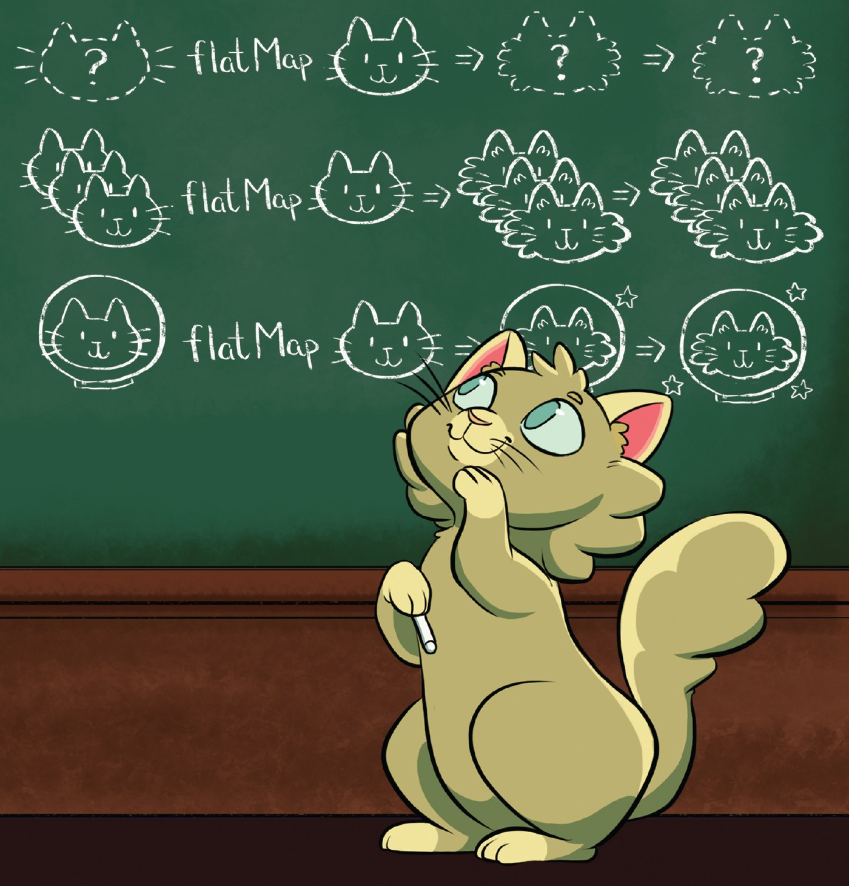
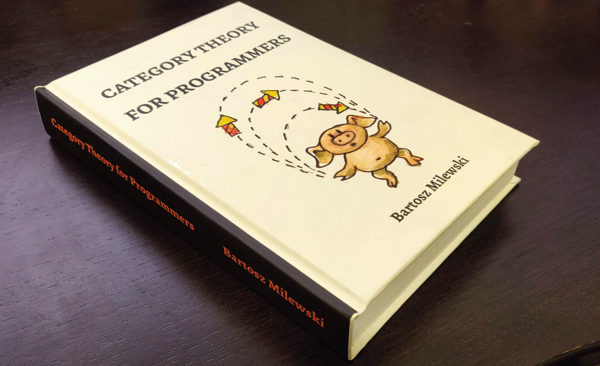
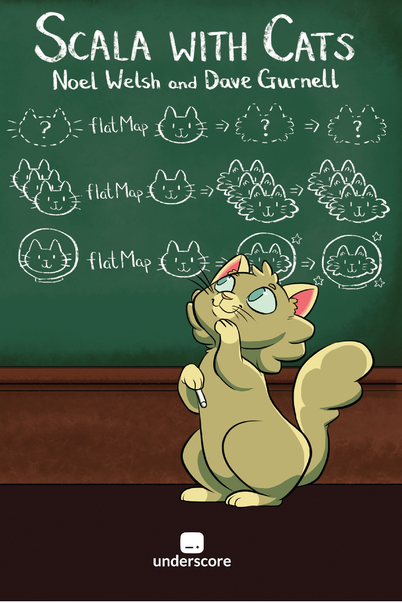

# Абстракции от по-висок ред

# Абстрактността в математиката

<p class="fragment">Примери: групи, полета, полиноми, векторни пространства и много други</p>

<p class="fragment">Алгебрични структури – множества със съответни операции и аксиоми (свойства)</p>

<p class="fragment">алгебрични структури ~ тип данни</p>

# Група

::: { .fragment }

Нека G е множество с бинарна операция „·“

G наричаме група, ако:

:::

::: incremental

* асоциативност – ∀ a, b, c ∈ G:
  
  ```
  (a · b) · c = a · (b · c)
  ```
* неутрален елемент – ∃ e ∈ G, такъв че ∀ a ∈ G
  
  ```
  e · a = a · e = a
  ```
* обратен елемент – ∀ a ∈ G, ∃ a' ∈ G, такъв че
  
  ```
  a · a' = a' · a = e
  ```

:::

# Моноид

Нека M е множество с бинарна операция „·“

M наричаме моноид, ако:

* асоциативност – ∀ a, b, c ∈ M:
  
  ```
  (a · b) · c = a · (b · c)
  ```
* неутрален елемент – ∃ e ∈ M, такъв че ∀ a ∈ M
  
  ```
  e · a = a · e = a
  ```

# Реализация?

::: { .fragment }

Задача: напишете метод `sum` работещ със списъци от различни типове

```scala
sum(List(1, 3, 4))
sum(List("a", "b", "c"))
sum(List(Rational(1, 2), Rational(3, 4)))
```

:::

# Контекст в програмния код

<p class="fragment">в математиката: „Нека фиксираме поле F, такова че...“</p>
<p class="fragment">в математиката: „Нека фиксираме ортогонална координатна система“</p>

#

<dl>
    <dt>context</dt>
    <dd>1. The parts of a written or spoken statement that precede or follow a specific word or passage, usually influencing its meaning or effect;</dd>
    <dd class="fragment">2. The set of circumstances or facts that surround a particular event, statement, idea, etc.</dd>
    <dd class="fragment">3. “What comes with the text, but is not in the text.”</dd>
</dl>

# Примери

Текуща:

* конфигурация
* транзакция
* сесия
* ExecutionContext – pool от нишки
* ...

# Контекст в програмния код

* import
* подтипов полиморфизъм
* dependency injection
* външен scope
* параметри

# Експлицитно предаване на контекст

# Имплицитно предаване на контекст

::: { .fragment }

В математиката: „Дадено е поле F, такова че...“

:::

::: { .fragment }

В Scala 3:

```scala
given f: Field[Double] = ???
```

:::

# Context bound

```scala
def sum[A : Monoid](xs: List[A])
```

# Логическо програмиране<br />в типовата система

::: incremental

* Типовата система е напълно логическа
* Търсенето на given стойности от определен тип съвпада с механиката на логическите изводи, позната ни от логическото програмиране
* При изводите *given без параметри* съответства на логически факти, а *given с параметри* на логически правила 

:::

#

Type class-овете дефинират операции и аксиоми/свойства, които даден тип трябва да притежава.

<p class="fragment">За да бъде един тип от даден клас, то трябва да предоставим валидна имплементация на операциите на type class-а</p>

# Аксиомите са важни

((a · b) · c) · d – едно по едно, от ляво надясно

(a · b) · (c · d) – балансирано и паралелизуемо

<p class="fragment">Могат да бъдат проверявани чрез тестове</p>

# `fold` vs `foldLeft`

```scala
(1 to 100000000).par.fold(0)(_ + _)
```

<p class="fragment">`fold` изисква асоциативна операция</p>

# ООП класове срещу type class-ове

<p class="fragment">Класовете в ООП моделират обекти</p>

<p class="fragment">Type class-овете моделират типове</p>

# Предния път

Type Class:

* Описват определена категория свойства на типовете
* Описват техни операции
* Със синтаксис за тях
* Спазващи определени аксиоми (закони)
* Фиксират се контексно
  * За да се разглежда даден тип от даден type class е нужно да бъде дадена (`given`) контекста инстанция
  * Може и за дефинирани други типове (ретроактивен полиморфизъм)
  * Един тип може да образува няколко различни type class-а

# Контекст в Scala 2

# Полиморфизъм

<p class="fragment">Използването на един и същи интерфейс с различни типове</p>

# Полиморфизъм в Scala

# Параметричен полиморфизъм (generics)

```scala
def mapTwice[A](xs: List[A])(f: A => A): List[A] =
  xs.map(f compose f)

mapTwice(List(1, 2, 3))(_ * 2) // List(4, 8, 12)
mapTwice(List("ab", "c", "def"))(str => str + str) // List(abababab, cccc, defdefdefdef)
```

# Ad hoc полиморфизъм

Избор на конкретна имплементация според конкретния тип

# Ad hoc полиморфизъм – overloading

```scala
def stringify(n: Int) = n.toString
def stringify(n: Rational) = s"$n.numer/$n.denom"

stringify(1) // "1"
stringify(Rational(1)) // "1/1"
```

# Ad hoc полиморфизъм – type classes

Пример: реализацията на <code>Monoid</code> се избира конкретно според типа

```scala
sum(List(Rational(2), Rational(4))) // rationalMonoid
sum(List(2, 4)) // intMonoid
```

# Подтипов полиморфизъм

```scala
trait Figure:
  def area: Double
  def circumference: Double

case class Circle(radius: Double) extends Figure:
  def area: Double = Pi * radius * radius
  def circumference: Double = 2 * Pi * radius

case class Square(side: Double) extends Figure:
  def area: Double = side * side
  def circumference: Double = 4 * side

val figure = getRandomFigure(10)
figure.area // 100
```

<p class="fragment">Липсва информация за конкретния тип, но се изпълнява конкретна имплементация</p>

# Duck typing и структурно подтипизиране

```scala
type Closable = { def close(): Unit }

def handle[A <: Closable, B](resource: A)(f: A => B): B =
  try f(resource) finally resource.close()

handle(new FileReader("file.txt"))(f => readLines(f))
```

# Binding

::: { .fragment }

* Static (compile time) – параметричен и ad-hoc полиморфизъм
* Late (runtime) – подтипов полиморфизъм и duck typing/структурно типизиране

:::

::: { .fragment }

Late binding-а е фундаментален за ООП

:::

# Ретроактивност

разширяване на тип без промяна на кода му

# Ретроактивен полиморфизъм

::: { .fragment }

добавяне на интерфейс към тип<br />без промяна на кода му

:::

::: { .fragment }

Type class-овете поддържат ретроактивен полиморфизъм

:::

# Numeric

# Ordering

# Сериализация до JSON

::: { .fragment }

По-късно в курса ще разгледаме библиотеката [`Circe`](https://circe.github.io/circe/)

:::

# Езици, поддържащи type class-ове

* Haskell
* Scala
* Rust
* Idris
* ...

#

В Haskell всеки type class може да има<br />само една инстанция за определен тип.

::: { .fragment }

В Scala липсва такова ограничение, което е едновременно и плюс и минус.

:::

# Библиотеки за type class-ове?

{ height="520" }

# Библиотеки

::: incremental

* Общи
  * [{ height="40" style="vertical-align: middle" } Cats](http://typelevel.org/cats/)
  * [Scalaz](https://scalaz.github.io)
* В конкретен домейн
  * [Spire](https://typelevel.org/spire/) – математически абстракции, използва Cats
  * [Cats Effects](https://typelevel.org/cats-effect/) – абстракции за асинхронност
  * ...

:::

# Категории

[{ height="520" }](https://github.com/hmemcpy/milewski-ctfp-pdf)

::: { .fragment }

[лекции в Youtube](https://www.youtube.com/watch?v=I8LbkfSSR58&list=PLbgaMIhjbmEnaH_LTkxLI7FMa2HsnawM_)

:::

# Cats

::: { .fragment }

Различни видове котк... категории 😸

:::

::: { .fragment }

{ height=480 }

:::

# Scala with Cats

[{ height="520" }](https://underscore.io/books/scala-with-cats/)

# Cats

Предоставя:

* [Type class-ове](https://typelevel.org/cats/typeclasses.html)
* Инстанции на тези type class-ове
* [Синтаксис](https://typelevel.org/cats/nomenclature.html) (предимно под формата на extension методи)
* [Data types](https://typelevel.org/cats/datatypes.html)
* [тестване на аксиоми](https://typelevel.org/cats/typeclasses/lawtesting.html)

# Data types

* [Chain](https://typelevel.org/cats/datatypes/chain.html)
* [Validated](https://typelevel.org/cats/datatypes/validated.html)
* [Ior](https://typelevel.org/cats/datatypes/ior.html)
* [Kleisli](https://typelevel.org/cats/datatypes/kleisli.html)
* [Id монада](https://typelevel.org/cats/datatypes/id.html)
* [State монада](https://typelevel.org/cats/datatypes/state.html)
* `FunctionK` (a.k.a. `~>`), `Nested`, `Free` –<br />ще разгледаме допълнително
* ...

# Синтаксис

# Синтаксис – Option

```scala
import cats.syntax.option.*

val maybeOne = 1.some // Some(1): Option[Int]
val maybeN = none[Int] // None: Option[Int]

val either = maybeOne.toRightNec("It's not there :(") // Right(1): Either[String, Int]
val validated = maybeOne.toValidNec("It's not there :(") // Left("..."): Either[String, Int]

val integer = maybeN.orEmpty // 0
```

# Синтаксис – Either и Validated

::: { .fragment }

```scala
import cats.syntax.either.*

val eitherOne = 1.asRight
val eitherN = "Error".asLeft

val eitherOneChain = 1.rightNec
val eitherNChain = "Error".leftNec

val recoveredEither = eitherN.recover {
  case "Error" => 42.asRight
}

eitherOneChain.toValidated
```

:::

::: { .fragment }

```scala
import cats.syntax.validated.*

val validatedOne = 1.validNec
val validatedN = "Error".invalidNec

validatedOne.toEither
```

:::

# Type class-ове

[Поглед над йеархиите](https://cdn.rawgit.com/tpolecat/cats-infographic/master/cats.svg)

# Type class-ове и синтаксис чрез implicit

::: { .fragment }

Да разгледаме отново дефинирането на Type Class-ове в [Scala 3](https://github.com/scala-fmi/scala-fmi-2022/tree/master/lectures/examples/09-type-classes/src/main/scala/math) и [Scala 2](https://github.com/scala-fmi/scala-fmi-2022/tree/master/lectures/examples/09-type-classes-scala-2/src/main/scala/math)

:::

::: incremental

* В Scala 3 инстанциите на type class-овете идват заедно с техния синтаксис (extension методи)
* В Scala 2 инстанциите и синтаксиса са разделени и е нужно да бъдат import-нати и двете
* Scala 2 използва `implicit` класове за extension методи
* В Scala 2 вместо `given` инстанции се използват `implicit` `val`-ове и `def`-ове
* В Scala 2 вместо `using` параметри се декларират `implicit` параметри
* Всичко останало работи по подобен начин
* Scala 3 позволява използване на `given`, където се очаква `implicit`, и използване на `implicit`, където се очаква `using`

:::

# Type class-ове и синтаксис чрез implicit

Cats използва изцяло Scala 2 синтаксиса за Type Class-ове (чрез `implicit`)

::: { .fragment }

[Cats Cheatsheet](../resources/cats-cheat-sheet.md)

:::

# Сравнение и наредба

::: { .fragment }

```scala
trait Eq[A]:
  def eqv(x: A, y: A): Boolean

  def neqv(x: A, y: A): Boolean = !eqv(x, y)
```

:::

# Semigroup и Monoid

```scala
trait Semigroup[A]:
  def combine(x: A, y: A): A
```
```scala
trait Monoid[A] extends Semigroup[A]:
  def empty: A
```

# Semigroup и Monoid синтаксис

```scala
import cats.syntax.monoid.*

1 |+| 2 // 3
"ab".combineN(3) // "ababab"

0.isEmpty // true

Semigroup[Int].combineAllOption(List(1, 2, 3)) // Some(6)
Monoid[Int].combineAll(List(1, 2, 3)) // 6
```

# Тестване на аксиоми

# Foldable

```scala
trait Foldable[F[_]]:
  def foldLeft[A, B](fa: F[A], b: B)(f: (B, A) => B): B
  def foldRight[A, B](fa: F[A], lb: Eval[B])(f: (A, Eval[B]) => Eval[B]): Eval[B]
```

# В заключение

Type class-овете:

:::incremental

* моделират типове
* предоставят общ интерфейс и аксиоми за цяло множество от типове
* или още – общ език, чрез който да мислим и боравим с тези типове
* позволяват ad hoc полиморфизъм
* наблягат на композитността и декларативността
* добавят се ретроактивно към типовете и в Scala могат да бъдат контекстно-зависими

:::

# Въпроси :)?
